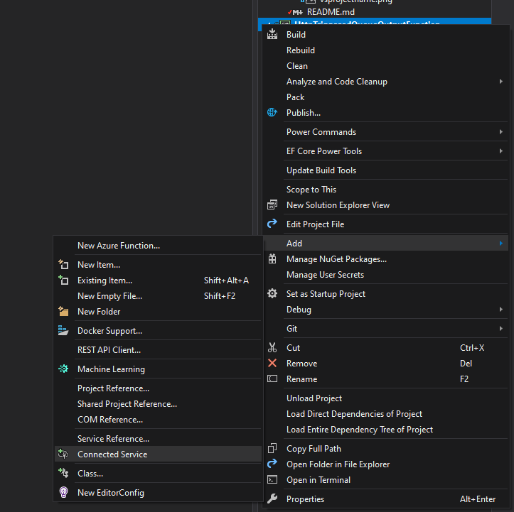

# Anatomy of an Azure Function

### What does an Azure function project look like?

I called my function HttpTriggeredQueueOutput because I intend to add some logic in the function that will result this function to enqueue something in a queue.

Looking at the folder, it looks pretty simple. There are some json files, the regular `.gitignore` files, then the Function itself, in a default `Function1.cs`.

Let us take a look at what the different json files are for.

### serviceDependencies.*.json

So this is a new feature that came along with Visual Studio 16.6 Preview 2. The idea was to be able to interact/configure with azure services without leaving the IDE!
How do you do this? Right click your project, go to **Add** > **Connected Service**

This should bring up something like

This tab will allow you to configure azure services as dependencies to your current project and these get stored in the `serviceDependencies.json`. Every service you configure as a dependency for this app, will get added to this file and its corresponding `local.json`. This is primarily used by Visual Studio. And it is safe to commit it to source control as these files do not contain any secrets.

There is a lot more information on this topic on the feature announcement page - [Configuring Azure Services and emulators using Visual Studio](https://devblogs.microsoft.com/aspnet/configuring-azure-services-and-emulators-using-visual-studio/).

I think covering this in detail, would be a different tutorial altogether, so I will let you read and learn from the above blog post.

### host.json

Azure Functions allows you to implement your system's logic into readily available blocks of code. These code blocks are called "functions". Different functions can run anytime you need to respond to critical events.
So in a function app, you may have several different functions doing related things or maybe different steps of the same bigger operation.

This `host.json` file is the global configuration options file that affects all the functions in your function app. This file has undergone changes since Azure Functions first started.

Currently Azure Functions are version 3.0+ the `host.json` file since version 2.0 has remained for this new version too. The options available to configure in this file aren't necessarily your app settings. But related or similar in certain ways.

You can read all about the different settings that you can configure in [host.json since version 2.x in docs.microsoft.com](https://docs.microsoft.com/en-gb/azure/azure-functions/functions-host-json)

### local.settings.json

As the name suggests, this is a file specifically used by Azure functions during the development stage in your machine. It is by default ignored from being checked into source control. "Why so?" you may ask. This is primarily because, during local development you might put some secrets or confidential credential information or API keys in this file. And as a best practice, it is not good to commit such information into source control. Although, I know that many of you have worked in firms, where committing connection strings in settings file is normal.
However, wait till you hire a security consultant.

This is where you generally put your storage account connection strings, database connection strings etc, application insights instrumentation key.

There is always a [reference on microsoft docs for the local.settings.json](https://docs.microsoft.com/en-gb/azure/azure-functions/functions-run-local?tabs=windows%2Ccsharp%2Cbash#local-settings-file)

### Function1.cs - Please rename to something you can recognize and remember

This is the main thing. Your code goes here. Please change the name of the file and class inside.

The class is static, but doesn't have to be.

Similarly the method is static but it doesn't have to be either.

Feel free to modify these based on your taste and if you are writing any tests or injecting any depdencies make necessary modifications to the class structure.

However, there is some important metadata in the code.

The first parameter to the function, `HttpRequest` has an attribute with some important additional information that is used by the function runtime.

* The Authorisation detail that you chose when creating the function is already there as an attribute parameter to the `HttpTrigger` attribute.
* Similarly, we also state the `http methods` supported by the function.
  * This one accepts `get` and `post`. Although there is an option to spoecify a specific route, in this case, I am leaving it as the default.
There is a `[FunctionName("Function1")]` attribute that has the functions name! When you rename your function don't forget to change this too.

I have renamed the function to `HttpTriggeredFunction.cs` and also removed the `static` modifier from the function and the class.
