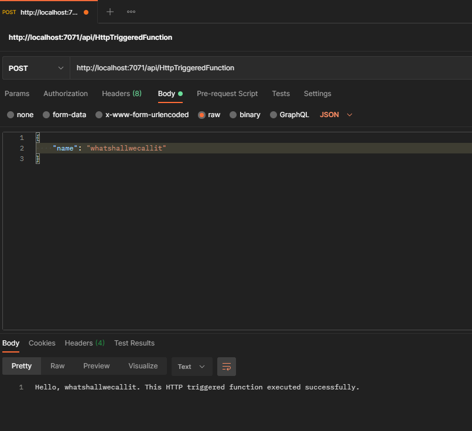
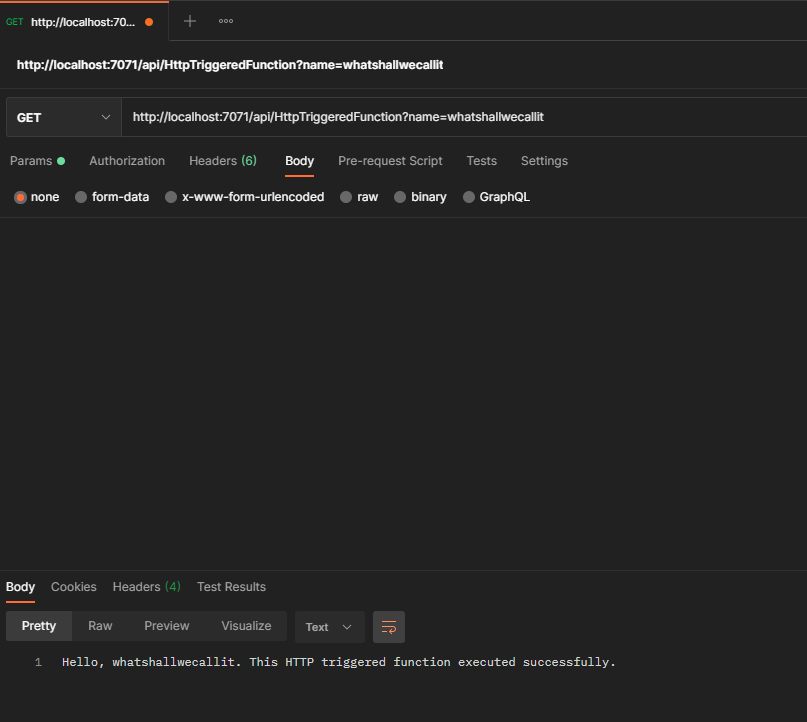
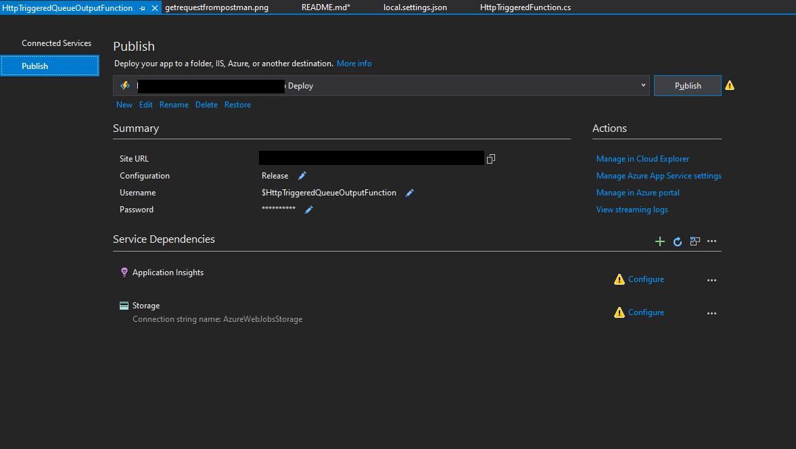

# Create an Azure function on Visual Studio 
 
You really don't need to download the professional or enterprise edition of Visual Studio to achieve this. All you need is the community edition of Visual Studio with the azure development facility installed.
You can download the latest [Visual Studio](https://visualstudio.microsoft.com/downloads/).

If you already have visual studio installed, then open visual studio installer and check if you have installed the Azure development tools.

If the Azure development checkbox is checked already, then you don't need anything more. Else, just install it.

### Installed all the pre-requisites, now what?

First of all, open visual studio.

Click on the New project option.

Search for Azure Function template and click next.

Give your project a name and click create

This should present you with a function creation wizard that gives you plenty of options.

We will take a look at these options in detail soon.

Choose the HTTP trigger option and choose Anonymous as the Authorization level.

### Anatomy of an Azure Function

Read more about what the different parts of the [Azure function project mean](./AnatomyOfAzureFunction.md). 

### Run the function

You should see the following cmd prompt:

So now that you are running this http triggered function, it is just waiting for a request. Give it one. 

I am going to use my favourite [Rest Client - Postman](https://www.postman.com/downloads/) for this purpose.

Let us look at how Postman's post request looks like:

What about the get request?

See how the `GET` takes a query param as input while the `POST` takes in a json in the body of the request. 
The URL has the name of the function which it actually picks from the `FunctionName("YourFunctionsName")` attribute and not the class name. 

### Publish the function to Azure

So that's fine, we created a function and it works locally so now we need to run it on Azure. After all that was the point. You can create the function on Azure through Visual studio! 
Right click on the function project and click `Publish`. 

You will be presented with a host of options and windows. And if you haven't yet configured a resource group, you will have the option to create that too through visual studio, so don't you worry at all. 

I had created my subscription specifically for learning and also created a resource group specifically for this purpose. Hence, I chose to just create my function through the visual studio function publish wizard. 

Please choose to publish on Azure, after all that was the whole point of this exercise.

Feel free to pick Windows or Linux. Totally upto you. The function is a C# function written in .NET Core so it will work on either.
I haven't personally explored the other options yet. I will find out what they are and add details about it later. 

Pick an appopriate Azure subscription and a resource group and if you have a function already created on the portal, you might be able to search for it within the resource group you have created.
Else just click on the `+` icon.

Give it a name and fill in all the other details including the hosting plan. This is a topic of discussion on its own.
Azure functions can be hosted in 3 different plans. The default is a consumption based plan which is the one wher eyou get hcarged on based on usage.
You can read more about [the different plans available on microsoft docs](https://docs.microsoft.com/en-gb/azure/azure-functions/functions-scale#overview-of-plans) 

There you have it! You just created an http triggered function and also deployed it to Azure!

This particular screenshot appears to have some warning icons and it is for good reason. We haven't configured any of those dependencies yet.

## Let us take a look at how to configure an important and useful feature

[Setting up Application Insights for your Azure function](./SetupAppInsights.md)

## Configure Azure Storage and link it to your app

[Setting up Azure Storage Account and link it to your app](./SetupStorageAccounts.md)

[Back to Main page](./README.md##configure-continuous-integration-pipeline-on-azure-devOps)