# Azure Functions

## What is an azure function?

As the name suggests, it is a function that runs on the cloud. But then you ask, all my code contains functions, and they can all be deployed on azure and so would they all be called azure functions?

Excellent question.

Well, I oversimplified, when I said that it is just a function that runs on the cloud.

* Azure functions is a service offered by Microsoft on its cloud infrastructure, where by you can focus on just writing your application code and not worry about the maintenance of the hardware that runs it.
* Functions on Azure can be charged on a pay as you go basis and hence you will only get charged according to the usage of the function.
* You also have the ability to scale out automatically based on your request load.

The idea behind this is generally known as [Serverless Computing](https://en.wikipedia.org/wiki/Serverless_computing)

## Creating your first Azure function

This might sound like a lot of work. But it is a lot easier than you think. You can do this in many ways. 
I'll see if I can explain all the ways.

### Using Visual Studio

You really don't need to download the professional or enterprise edition of Visual Studio to achieve this. All you need is the community edition of Visual Studio with the azure development facility installed.
You can download the latest [Visual Studio](https://visualstudio.microsoft.com/downloads/).

If you already have visual studio installed, then open visual studio installer and check if you have installed the Azure development tools.
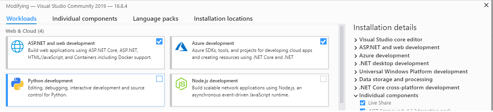

If the Azure development checkbox is checked already, then you don't need anything more. Else, just install it.

### Installed all the pre-requisites, now what?

First of all, open visual studio.

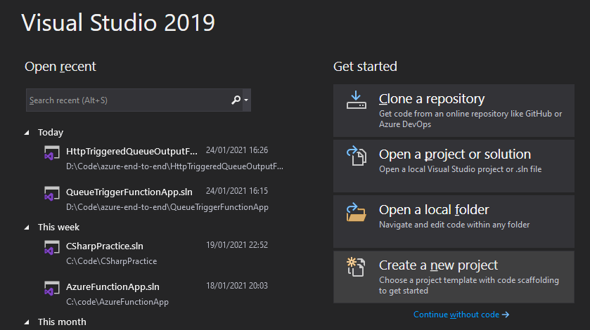

Click on the New project option.

Search for Azure Function template and click next.
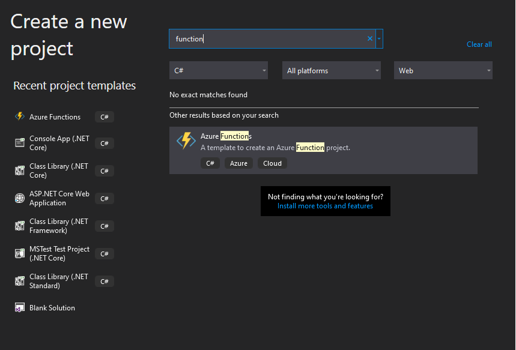

Give your project a name and click create
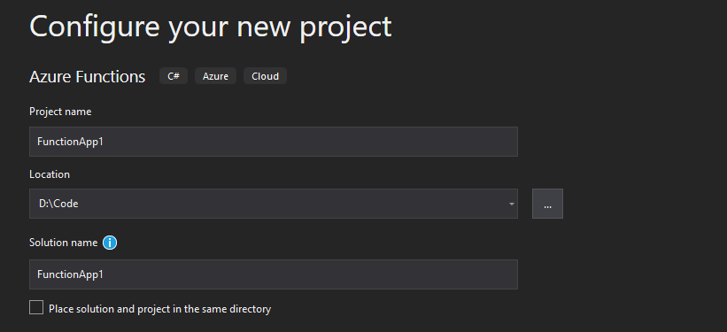

This should present you with a function creation wizard that gives you plenty of options.

We will take a look at these options in detail soon.

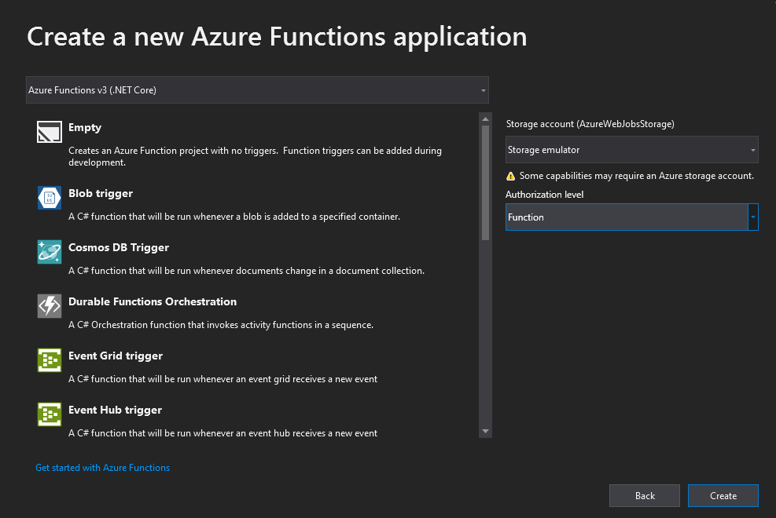

Choose the HTTP trigger option and choose Anonymous as the Authorization level.

### What does an Azure function project look like?

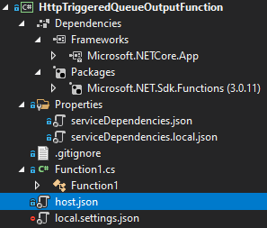

I called my function HttpTriggeredQueueOutput because I intend to add some logic in the function that will result this function to enqueue something in a queue.

Looking at the folder, it looks pretty simple. There are some json files, the regular `.gitignore` files, then the Function itself, in a default `Function1.cs`.

Let us take a look at what the different json files are for.

### serviceDependencies.*.json

So this is a new feature that came along with Visual Studio 16.6 Preview 2. The idea was to be able to interact/configure with azure services without leaving the IDE!
How do you do this? Right click your project, go to **Add** > **Connected Service**

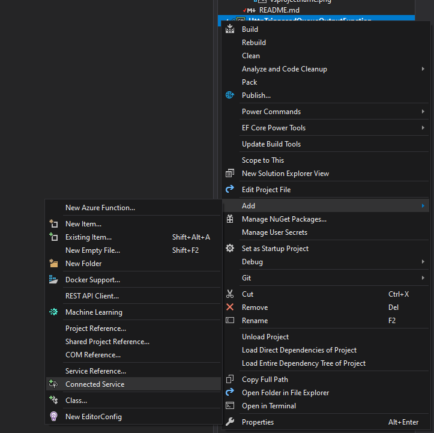

This should bring up something like

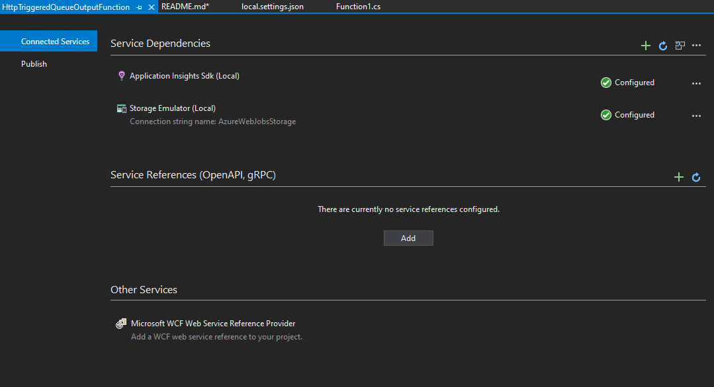

This tab will allow you to configure azure services as dependencies to your current project and these get stored in the `serviceDependencies.json`. Every service you configure as a dependency for this app, will get added to this file and its corresponding `local.json`. This is primarily used by Visual Studio. And it is safe to commit it to source control as these files do not contain any secrets.

There is a lot more information on this topic on the feature announcement page - [Configuring Azure Services and emulators using Visual Studio](https://devblogs.microsoft.com/aspnet/configuring-azure-services-and-emulators-using-visual-studio/).

I think covering this in detail, would be a different tutorial altogether, so I will let you read and learn from the above blog post.

### host.json

Azure Functions allows you to implement your system's logic into readily available blocks of code. These code blocks are called "functions". Different functions can run anytime you need to respond to critical events.
So in a function app, you may have several different functions doing related things or maybe different steps of the same bigger operation.

This `host.json` file is the global configuration options file that affects all the functions in your function app. This file has undergone changes since Azure Functions first started.

Currently Azure Functions are version 3.0+ the `host.json` file since version 2.0 has remained for this new version too. The options available to configure in this file aren't necessarily your app settings. But related or similar in certain ways.

You can read all about the different settings that you can configure in [host.json since version 2.x in docs.microsoft.com](https://docs.microsoft.com/en-gb/azure/azure-functions/functions-host-json)

### local.settings.json

As the name suggests, this is a file specifically used by Azure functions during the development stage in your machine. It is by default ignored from being checked into source control. "Why so?" you may ask. This is primarily because, during local development you might put some secrets or confidential credential information or API keys in this file. And as best practice, it is not good to commit such information into source control. Although, I know that many of you have worked in firms, where committing connection strings in settings file is normal.
However, wait till you hire a security consultant.

This is where you generally put your storage account connection strings, database connection strings etc.

There is always a [reference on microsoft docs for the local.settings.json](https://docs.microsoft.com/en-gb/azure/azure-functions/functions-run-local?tabs=windows%2Ccsharp%2Cbash#local-settings-file)

### Function1.cs - Please rename to something you can recognize and remember

This is the main thing. Your code goes here. Please change the name of the file and class inside.

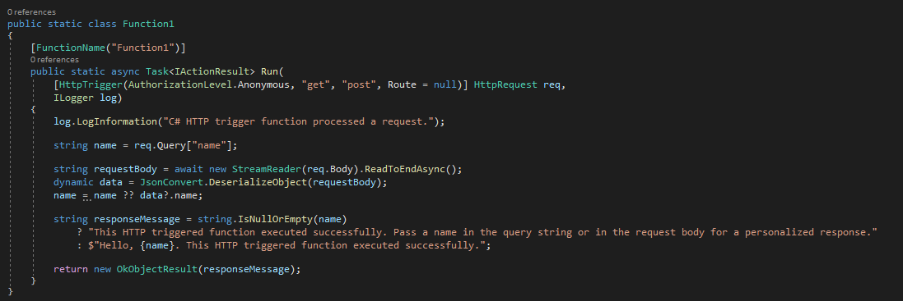

The class is static, but doesn't have to be.

Similarly the method is static but it doesn't have to be either.

Feel free to modify these based on your taste and if you are writing any tests or injecting any depdencies make necessary modifications to the class structure.

However, there is some important metadata in the code.

The first parameter to the function, `HttpRequest` has an attribute with some important additional information that is used by the function runtime.

* The Authorisation detail that you chose when creating the function is already there as an attribute parameter to the `HttpTrigger` attribute.
* Similarly, we also state the `http methods` supported by the function.
  * This one accepts `get` and `post`. Although there is an option to spoecify a specific route, in this case, I am leaving it as the default.
There is a `[FunctionName("Function1")]` attribute that has the functions name! When you rename your function don't forget to change this too.

I have renamed the function to `HttpTriggeredFunction.cs` and also removed the `static` modifier from the function and the class.

### Run the function

You should see the following cmd prompt:

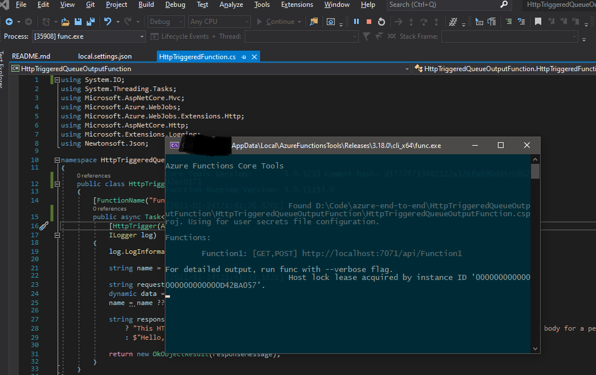

So now that you are running this http triggered function, it is just waiting for a request. Give it one. 

I am going to use my favourite [Rest Client - Postman](https://www.postman.com/downloads/) for this purpose.

Let us look at how Postman's post request looks like:

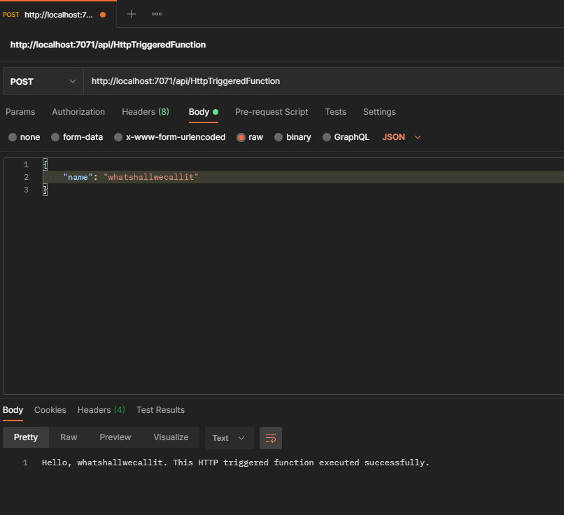

What about the get request?

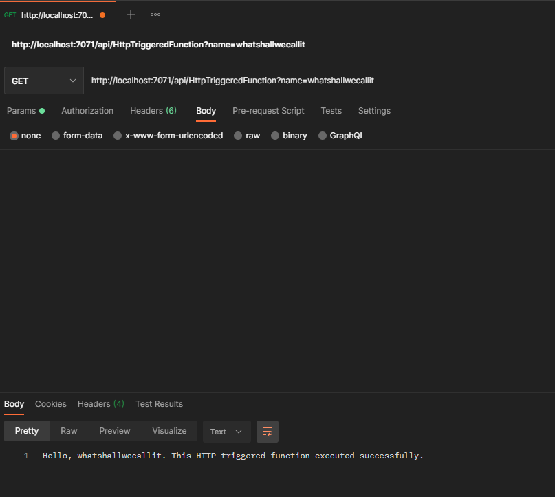

See how the `GET` takes a query param as input while the `POST` takes in a json in the body of the request. 
The URL has the name of the function which it actually picks from the `FunctionName("YourFunctionsName")` attribute and not the class name. 

### Publish the function to Azure

So that's fine, we created a function and it works locally so now we need to run it on Azure. After all that was the point. You can create the function on Azure through Visual studio! 
Right click on the function project and click `Publish`. 

You will be presented with a host of options and windows. And if you haven't yet configured a resource group, you will have the option to create that too through visual studio, so don't you worry at all. 

I had created my subscription specifically for learning and also created a resource group specifically for this purpose. Hence, I chose to just create my function through the visual studio function publish wizard. 

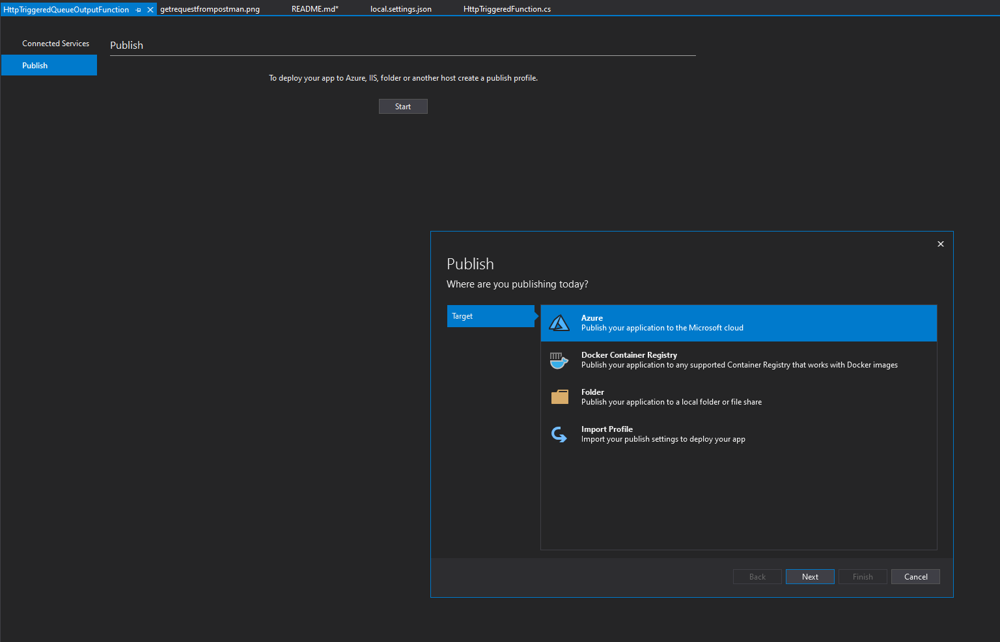
Please choose to publish on Azure, after all that was the whole point of this exercise.

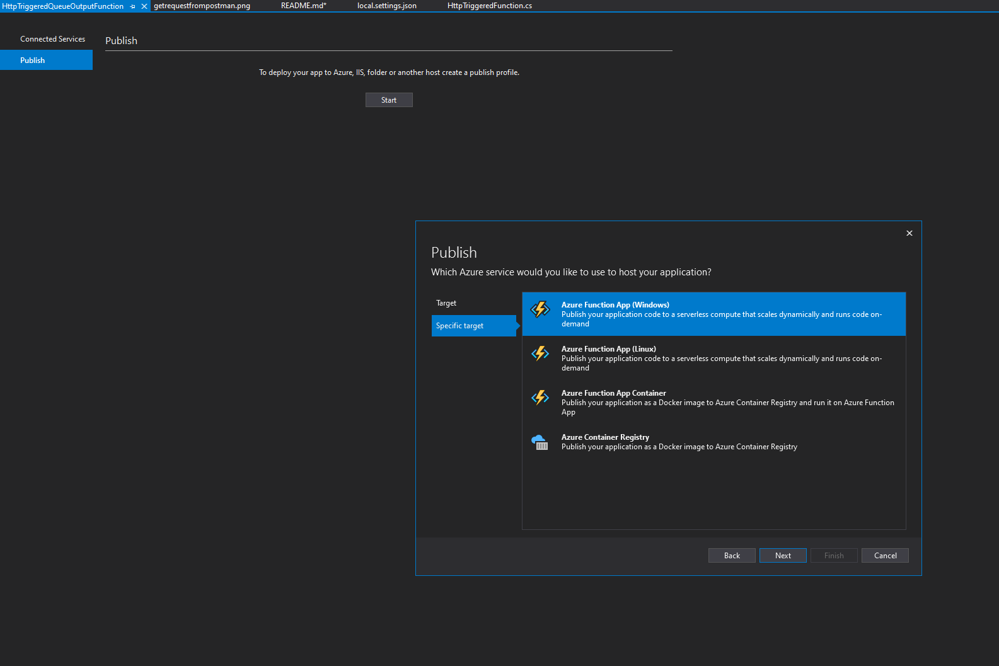
Feel free to pick Windows or Linux. Totally upto you. The function is a C# function written in .NET Core so it will work on either.
I haven't personally explored the other options yet. I will find out what they are and add details about it later. 

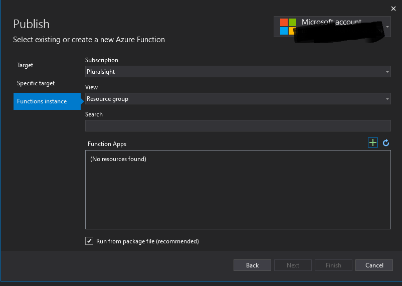
Pick an appopriate Azure subscription and a resource group and if you have a function already created on the portal, you might be able to search for it within the resource group you have created.
Else just click on the `+` icon.

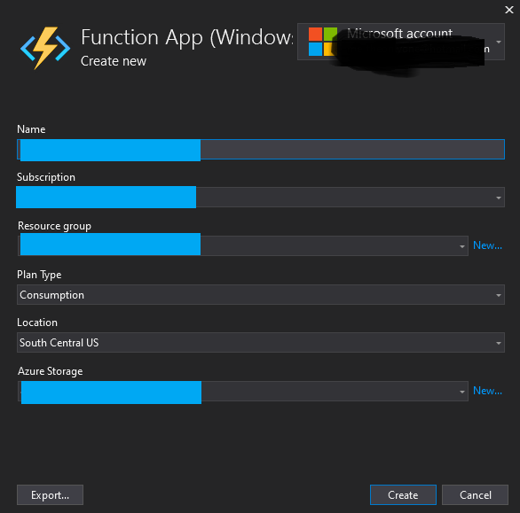
Give it a name and fill in all the other details including the hosting plan. This is a topic of discussion on its own.
Azure functions can be hosted in 3 different plans. The default is a consumption based plan which is the one wher eyou get hcarged on based on usage.
You can read more about [the different plans available on microsoft docs](https://docs.microsoft.com/en-gb/azure/azure-functions/functions-scale#overview-of-plans) 

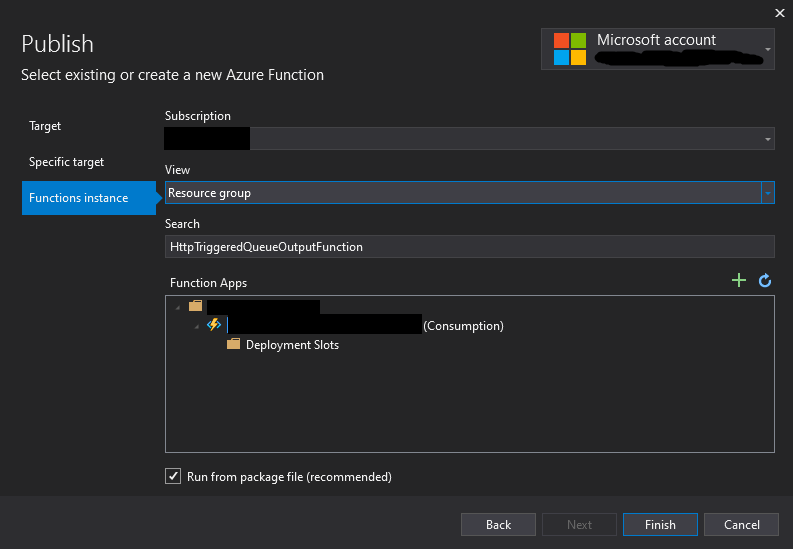
There you have it! You just created an http triggered function and also deployed it to Azure!

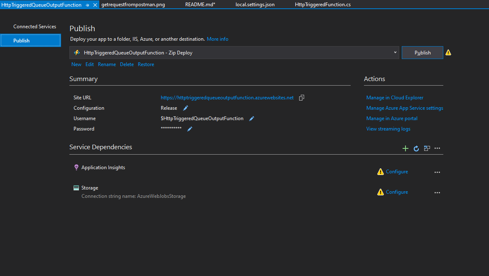
This particular screenshot appears to have some warning icons and it is for good reason. We haven't configured any of those dependencies yet. 
We will do this as a next step, soon, maybe even tomorrow.

## Let us take a look at how to configure an important and useful feature

[Setting up Application Insights for your Azure function](./SetupAppInsights.md)

## Configure Azure Storage and link it to your app

[Setting up Azure Storage Account and link it to your app](./SetupStorageAccounts.md)
