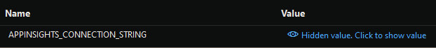
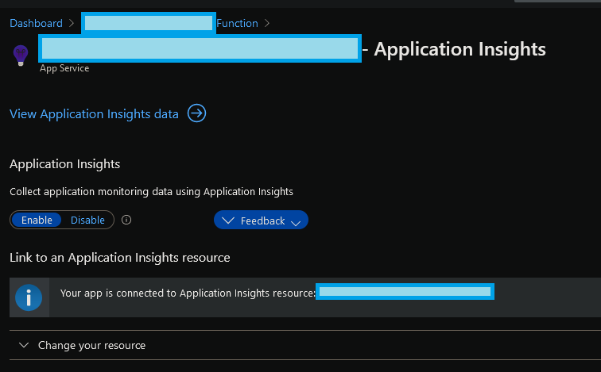
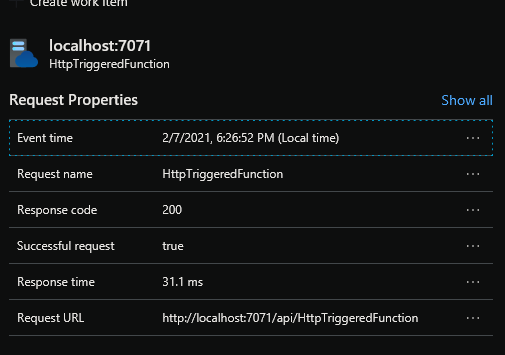

# Application Insights

Logging and monitoring are a key part of every application in general. It becomes even more important when you go serverless as you don't have the option to log into a server and look for the operating system logs there. So it would be foolish to not configure logging for your Azure function. 

Luckily, Azure functions, are hooked into Microsoft's telemetry logging platform - Application Insights. As Microsoft describes it

    Application insights, a feature of Azure Monitor, is an extensible Application Performance Management service for developers and DevOps professionals.

Refer the [Application Insights official documentation](https://docs.microsoft.com/en-us/azure/azure-monitor/app/app-insights-overview) to read more about this amazing offering. I can assure you that every one of my cloud hosted application is configured to push logs to Application Insights. There is a lot to talk about its features, however, for this tutorial, let us sticking to understanding how to configure your function app to log into app-insights. 

## Configuration

If you are using Visual Studio, like I was showing you in the earlier page, you can configure application insights directly from the IDE, within the same Publish window.

In the service dependencies section, you might have noticed that it shows Application Insights and a configure button. 

It is totally upto you to do this in the IDE or on azure portal. For convenience and continuity, I'm going to do it from the IDE. I have done it from the portal too and I must admit, Microsoft has done a great job at keeping the experience very consistent on the IDE and the portal.

    PS: I will not be sharing as many screenshots as I did earlier. This is due to the feedback I received about screenshots. Applications evolve and appearances might change. So I'm better off describing the inputs in words than in pictures. Although a picture speaks a thousand words, it is probably not great for this context. 

### On the portal

If you want to configure your function with application insights on the portal, head to the [portal](https://portal.azure.com/), search for the function using the search input box, find your function and then look for `Application Insights` in the navigation pane and you wil be presented the option to `Turn on Application Insights`.

If you clicked on the button, the remaining set of input required, will be similar whether you do it from the IDE or the portal.

### On the IDE

- Click on the configure button that you saw in the screenshot earlier that is next to the Application Insights icon in the Service Dependencies. 

- Choose your subscription from the list if you have many. I think by default, it selects the subscription associated to the function. 

- This step is dependent on whether you already have an AppInsights instance in the subscription. If you do, you may not want to add another. But if you don't, click on the button to add Application Insights. At the moment, it is something sort of a plus sign.

- Key in the name of the Application Insights instance, Subscription (again), a resource group (I'd just stick to the one that the function is associated to), Location (same choice as the function). The defaults loaded might actually be just the same as the function. 
  - AppInsight instance names, can be the same as the function. This tells those joining your team that you are only logging information from this particular function app for reasons that you only know. A common practice is to direct all logging from related applications, or a Bounded Context, that belongs to a certain environment (development, staging, etc.) to a shared instance of application insights. This helps in getting a birds-eye-view of the interaction between these different related apps in the `Application Maps` section.

- Once you have added an AppInsights instance, you can configure that application insights to be the target of the telemetry from the app. The IDE's wizard would present to you the ability to save the `APPINSIGHTS_CONNECTION_STRING` into your Azure app settings. Accept it and proceed to confirm that you can close the wizard on successful configuration! The configure button will now be accomponied with a green success symbol - a check/tick symbol. 
  - **Please see [Troubleshooting Application Insights](#troubleshooting-application-insights). I have corrected the name of the connection string setting here after I found the problem. Apologies for not finding it earlier.**
  - Connection string setting for AppInsights aren't used by the azure function - 

- When you have set it all up correctly, you will be able to see something similar to the following screenshot in your Azure Portal. 
    - 

- Copy the URL of the function app from the publish window

- Paste it into our browser and add the following part to the url
  - `api/yourfunctionname?name=somename`
  - You could use a REST client like [Rest Client - Postman](https://www.postman.com/downloads/) and test it too

- Do keep that in mind. Your HTTP Function Url, isn't really the url that you copied from the Publish window or the portal. Every function app can contain more than one function. This is exactly why each of the functions within the same function app, will have a different url.

Are you ready to go then?
Well, in my case, I had already configured the storage account on the portal. So I could run the function right away hosted on Azure using the browser itself and it started logging to the application insights instance too.

Let us take a brief look at [Setting up Azure Storage Account and link it to your app](./SetupStorageAccounts.md)

## Troubleshooting Application insights

So you followed all the instructions given here and you didn't get any logs in application insights!? I'm not surprised. I had the same problem. I checked the Configuration section for the Azure function and saw that there was a setting called `APPINSIGHTS_CONNECTIONSTRING` and I assumed that would be sufficient for the azure function to know which Application Insights instance it should log to.

This I initially thought was a mistake! I thought it was a TYPO on my part. The actual name of the setting is supposed to be `APPINSIGHTS_CONNECTION_STRING`? or so I thought.

This is clearly  mentioned in [the microsoft docs for Application Insights Connection strings](https://docs.microsoft.com/en-us/azure/azure-monitor/app/sdk-connection-string?tabs=net#environment-variable).

However, adding this environment variable or app setting in the local settings didn't seem to work for the azure function! Logs didn't appear in application insights. Again the logs don't appear instantly, there is a bit of delay but not like a half an hour delay, just a few minutes. 

I was told through twitter by Azure Support that, if the connection string setting is set, then Application insights would be setup correctly. If however, that is not set correctly, then the app will fallback to the AppInsights Instrumentation key settings. But this doesn't seem to be the case for Azure Functions!

**In order get your Azure Function to log to application insights, you need to set the Instrumentation Key setting and not the AppInsights Connection string. Throughout the [Monitoring docs for Azure functions](https://docs.microsoft.com/en-us/azure/azure-functions/configure-monitoring?tabs=v2) it is mentioned that the instrumentation key is what is necessary. It is the setting named `APPINSIGHTS_INSTRUMENTATIONKEY` that matters. If you ignore this, your logs will not appear in the desired AppInsights instance.**

## Test Configuration locally

Once you have `APPINSIGHTS_INSTRUMENTATIONKEY` set correctly in the `local.settings.json` you can run your function app view the requests being logged in there.

An example logged request can be seen here: 

Apologies for the confusion but I had to find it out the hard way too.

[Back to Main page](./README.md##configure-azure-storage-and-link-it-to-your-app)
